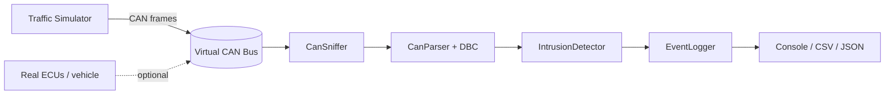

# CAN Bus Sniffer & Parser

[](https://github.com/thiagoricardop/can-bus-sniffer-parser/actions/workflows/ci.yml)
[](https://www.python.org/)
[](LICENSE)

A lightweight **CAN bus sniffer, DBC-based parser, and intrusion-detection (IDS) demo**
for automotive-cybersecurity learning and experimentation. It captures CAN frames, decodes their signals using a `.dbc` database, and flags suspicious traffic (unknown arbitration IDs, out-of-range signal values, and bus-flooding attacks).

It runs entirely on a **virtual CAN bus**, so **no hardware is required** — on Linux, macOS, or Windows.

> ⚠️ **Ethical use only.** Run this only against virtual buses or vehicles/benches you
> own or are explicitly authorized to test. Never connect it to a vehicle you do not
> have permission to access.

---

## ✨ Features

- **Live sniffing** of CAN traffic via [`python-can`](https://python-can.readthedocs.io/)
  (virtual, `socketcan`, `slcan`, etc.).
- **DBC decoding** of raw frames into named messages and physical signal values via
  [`cantools`](https://cantools.readthedocs.io/).
- **Intrusion Detection (IDS) layer** with three rules:
  - `UNKNOWN_ID` — arbitration ID not in the allowlist (spoofing / rogue ECU).
  - `SIGNAL_RANGE` — decoded signal outside its valid physical range (tampering).
  - `FLOOD` — too many frames for one ID inside a time window (DoS / bus flooding).
- **Structured logging** to console, CSV, and JSON Lines.
- **Traffic simulator** that generates normal traffic and an optional attack injection,
  so you can see the IDS trigger end-to-end.
- **Unit tests + GitHub Actions CI** with coverage.

---

## 🧭 Architecture



See [docs/architecture.md](docs/architecture.md) for the frame-processing sequence and
rule details.

---

## 📦 Project structure

```
can-bus-sniffer-parser/
├── .github/workflows/ci.yml   # CI: lint-free test run + coverage on 3.10–3.12
├── dbc/sample.dbc             # Example CAN database (Engine + Vehicle Speed)
├── docs/architecture.md       # Design notes and sequence diagram
├── src/can_sniffer/
│   ├── __init__.py
│   ├── parser.py              # Raw frame -> ParsedFrame (+ DBC signal decoding)
│   ├── ids.py                 # Intrusion-detection rules
│   ├── logger.py              # Console / CSV / JSON logging
│   ├── sniffer.py             # Reads the bus and orchestrates parse + IDS
│   ├── simulator.py           # Generates normal + attack traffic (no hardware)
│   └── cli.py                 # `can-sniffer` command-line entry point
├── tests/                     # pytest unit tests
├── pyproject.toml
├── requirements.txt
├── LICENSE
└── README.md
```

---

## 🚀 Quick start

### 1. Install

```bash
git clone https://github.com/thiagoricardop/can-bus-sniffer-parser
cd can-bus-sniffer-parser
python -m venv .venv
# Linux/macOS: source .venv/bin/activate
# Windows:     .venv\Scripts\activate
pip install -e ".[dev]"
```

### 2. Run the demo (no hardware needed)

Generates normal traffic, injects a flooding/spoofing attack, and shows the IDS firing:

```bash
can-sniffer demo --dbc dbc/sample.dbc --attack
```

Example output:

```
[1712345678.021] 0x100 (8) EngineData {'EngineRPM': 800.0, 'EngineTemp': 90.0, 'ThrottlePos': 20.0}
[1712345678.041] 0x200 (8) VehicleSpeed {'Speed': 50.0}
[1712345678.090] ALERT UNKNOWN_ID 0x666: Arbitration ID 0x666 not in allowlist
[1712345678.140] ALERT FLOOD 0x666: 41 frames in 1.0s window
```

### 3. Sniff a real/virtual interface

```bash
# Linux SocketCAN example (set up a virtual interface first):
#   sudo modprobe vcan && sudo ip link add dev vcan0 type vcan && sudo ip link set up vcan0
can-sniffer sniff --interface socketcan --channel vcan0 --dbc dbc/sample.dbc \
    --csv capture.csv --json capture.jsonl
```

---

## 🧪 Tests & coverage

```bash
pytest --cov=can_sniffer --cov-report=term-missing
```

---

## 🗺️ Roadmap

- [ ] Replay captured `candump` logs.
- [ ] Rule configuration from a YAML file.
- [ ] UDS (ISO 14229) request/response awareness.
- [ ] Baseline-learning mode (auto-build the allowlist from clean traffic).

---

## 📚 Why this project

Built to practice the core of **automotive cybersecurity**: in-vehicle networking (CAN), signal decoding (DBC), and intrusion detection on the vehicle bus. It maps to concepts from ISO/SAE 21434 (threat detection on in-vehicle networks) and common CAN attack classes (spoofing, flooding, and signal tampering).

## 📄 License

MIT — see [LICENSE](LICENSE).
