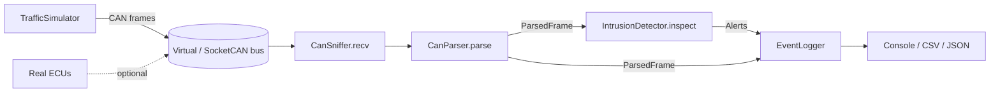
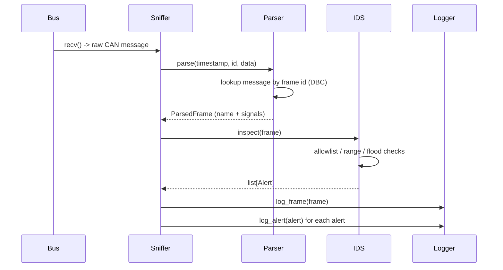

# Architecture

## Overview

The tool is a small pipeline: frames enter from a CAN bus, get decoded against a DBC
database, are inspected by a stateful intrusion detector, and are then logged.

## Frame-processing sequence

## Components

| Module         | Responsibility                                                        |
|----------------|-----------------------------------------------------------------------|
| `parser.py`    | Convert raw frames to `ParsedFrame`; decode signals using a DBC file. |
| `ids.py`       | Stateful detector with `UNKNOWN_ID`, `SIGNAL_RANGE`, and `FLOOD` rules.|
| `sniffer.py`   | Own the bus connection; stream frames through parser + IDS.           |
| `logger.py`    | Emit frames and alerts to console, CSV, and JSON Lines.               |
| `simulator.py` | Produce normal and attack traffic for hardware-free demos.            |
| `cli.py`       | `sniff` and `demo` subcommands.                                       |

## Detection rules

- **UNKNOWN_ID** — The arbitration ID is not in the configured allowlist. Models a
  rogue ECU or an injected/spoofed message ID.
- **SIGNAL_RANGE** — A decoded signal value falls outside its valid physical range
  (e.g. engine RPM above the redline). Models data tampering or a faulty/malicious node.
- **FLOOD** — More than `flood_threshold` frames for a single ID occur within
  `flood_window` seconds. Models a bus-flooding / denial-of-service attack.

## Mapping to automotive-security concepts

These rules are deliberately simple analogues of real in-vehicle intrusion-detection
techniques discussed in ISO/SAE 21434 and automotive IDS literature: allowlisting of
known message identifiers, physical-range plausibility checks, and message-frequency
(timing) anomaly detection on the CAN bus.
